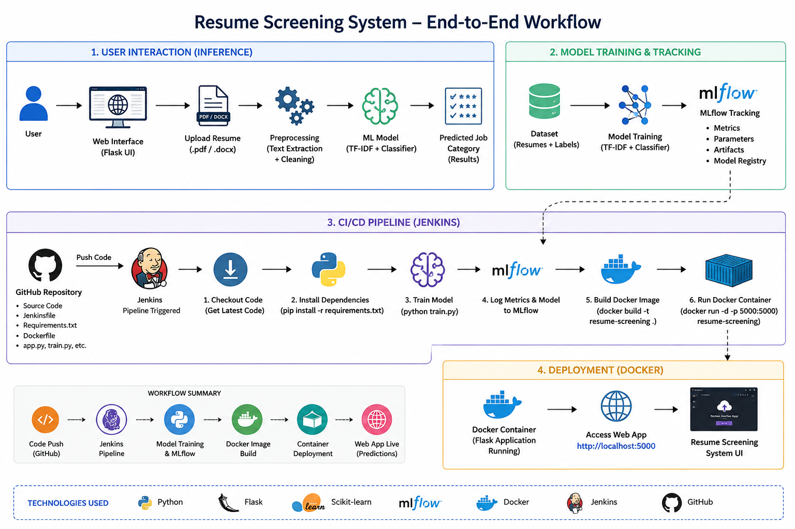

# Self-Updating Resume Screening System

An end-to-end MLOps + DevOps project that automatically classifies uploaded resumes into job categories using Machine Learning, while supporting automated retraining and deployment using Jenkins CI/CD, Docker, and MLflow.

---

# Project Overview

This system allows users to upload resumes in PDF or DOCX format through a Flask web application. The uploaded resume is processed using NLP techniques and classified into predefined job categories using a Machine Learning model.

The project also integrates DevOps and MLOps practices:
- MLflow for experiment tracking and model management
- Docker for containerization
- Jenkins for CI/CD automation
- GitHub for source control integration

---

# Features

- Resume upload using Flask web UI
- Resume classification using Machine Learning
- NLP preprocessing and TF-IDF vectorization
- MLflow experiment tracking
- Docker containerization
- Jenkins CI/CD pipeline
- Automatic retraining workflow
- GitHub integration
- Automated deployment pipeline

---

# Technologies Used

## Machine Learning
- Python
- Scikit-learn
- TF-IDF Vectorizer
- Logistic Regression / SGD Classifier
- NLP Preprocessing

## DevOps / MLOps
- MLflow
- Docker
- Jenkins
- GitHub

## Web Development
- Flask
- HTML
- CSS

---

# System Workflow

```text
User Upload Resume
        ↓
Flask Web Application
        ↓
Resume Text Extraction
        ↓
Text Preprocessing
        ↓
TF-IDF Vectorization
        ↓
Machine Learning Prediction
        ↓
Predicted Job Category
```

---

# CI/CD Workflow

```text
GitHub Push
      ↓
Jenkins Pipeline Trigger
      ↓
Install Dependencies
      ↓
Model Retraining
      ↓
MLflow Tracking
      ↓
Docker Image Build
      ↓
Container Deployment
      ↓
Updated Resume Screening System
```

---

# Project Architecture



---

# Installation

## Clone Repository

```bash
git clone https://github.com/Sotus12/resume-screening-system.git
cd resume-screening-system
```

---

## Install Dependencies

```bash
pip install -r requirements.txt
```

---

# Run Training

```bash
python train.py
```

---

# Run Flask Application

```bash
python app.py
```

Open browser:

```text
http://localhost:5000
```

---

# Run Docker Container

## Build Docker Image

```bash
docker build -t resume-screening .
```

## Run Container

```bash
docker run -p 5000:5000 resume-screening
```

---

# Run MLflow Dashboard

```bash
mlflow ui --port 5001
```

Open:

```text
http://localhost:5001
```

---

# Jenkins CI/CD Pipeline

The Jenkins pipeline automates:
- code integration
- model retraining
- Docker image creation
- deployment process

Pipeline stages:
1. Clone Repository
2. Install Dependencies
3. Train Model
4. Build Docker Image
5. Deploy Container

---

# Dataset

Resume Dataset containing multiple job categories:
- HR
- Engineering
- Finance
- Healthcare
- IT
- Sales
- Teacher
- Consultant
- Banking
- and more...

---

# Future Improvements

- AWS EC2 Deployment
- Kubernetes Integration
- Resume Ranking System
- Skill Extraction
- User Authentication
- Email Notifications
- LLM-based Resume Analysis

---

# Author

Satyam Savarna

---

# License

This project is for educational and learning purposes.
